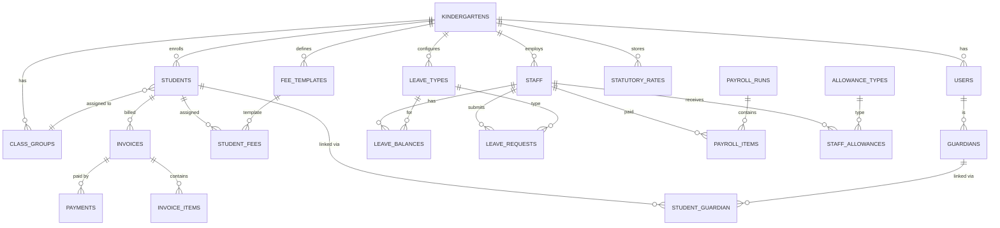

# KinderPay — Database Schema Design

**Version**: 1.0
**Date**: 2026-09-20
**Author**: Ed (Solution Architect)
**Status**: Draft

---

## 1. Entity-Relationship Diagram



---

## 2. Table Definitions

### 2.1 Core / Tenant

#### `kindergartens`

| Column | Type | Constraints | Description |
|---|---|---|---|
| id | BIGINT UNSIGNED | PK, AUTO_INCREMENT | |
| name | VARCHAR(255) | NOT NULL | Kindergarten name |
| registration_no | VARCHAR(100) | NULLABLE | SSM/JPNIN registration |
| address | TEXT | NULLABLE | Full address |
| city | VARCHAR(100) | NULLABLE | |
| state | VARCHAR(50) | NULLABLE | |
| postcode | VARCHAR(10) | NULLABLE | |
| phone | VARCHAR(20) | NULLABLE | |
| email | VARCHAR(255) | NULLABLE | |
| logo_path | VARCHAR(500) | NULLABLE | Logo for PDFs |
| invoice_prefix | VARCHAR(10) | DEFAULT 'INV' | Invoice number prefix |
| invoice_day | TINYINT | DEFAULT 1 | Day of month to generate invoices |
| payment_gateway | VARCHAR(50) | DEFAULT 'billplz' | |
| gateway_api_key | TEXT | NULLABLE, ENCRYPTED | |
| gateway_collection_id | VARCHAR(100) | NULLABLE | |
| timezone | VARCHAR(50) | DEFAULT 'Asia/Kuala_Lumpur' | |
| created_at | TIMESTAMP | | |
| updated_at | TIMESTAMP | | |

#### `users`

| Column | Type | Constraints | Description |
|---|---|---|---|
| id | BIGINT UNSIGNED | PK | |
| kindergarten_id | BIGINT UNSIGNED | FK → kindergartens.id, NULLABLE | NULL for super admin |
| name | VARCHAR(255) | NOT NULL | |
| email | VARCHAR(255) | UNIQUE, NOT NULL | |
| password | VARCHAR(255) | NOT NULL | bcrypt hashed |
| role | ENUM | 'super_admin','admin','accounts','teacher','parent' | |
| email_verified_at | TIMESTAMP | NULLABLE | |
| remember_token | VARCHAR(100) | NULLABLE | |
| created_at | TIMESTAMP | | |
| updated_at | TIMESTAMP | | |

---

### 2.2 Student Management

#### `class_groups`

| Column | Type | Constraints | Description |
|---|---|---|---|
| id | BIGINT UNSIGNED | PK | |
| kindergarten_id | BIGINT UNSIGNED | FK | |
| name | VARCHAR(100) | NOT NULL | e.g., "5 Tahun A" |
| academic_year | YEAR | NOT NULL | |
| capacity | INT | NULLABLE | Max students |
| teacher_id | BIGINT UNSIGNED | FK → staff.id, NULLABLE | Assigned teacher |
| created_at | TIMESTAMP | | |
| updated_at | TIMESTAMP | | |

#### `students`

| Column | Type | Constraints | Description |
|---|---|---|---|
| id | BIGINT UNSIGNED | PK | |
| kindergarten_id | BIGINT UNSIGNED | FK | |
| class_group_id | BIGINT UNSIGNED | FK, NULLABLE | |
| name | VARCHAR(255) | NOT NULL | |
| ic_number | VARCHAR(20) | NULLABLE, ENCRYPTED | MyKid number |
| date_of_birth | DATE | NOT NULL | |
| gender | ENUM('male','female') | NOT NULL | |
| photo_path | VARCHAR(500) | NULLABLE | |
| allergies | TEXT | NULLABLE | |
| medical_notes | TEXT | NULLABLE | |
| enrollment_date | DATE | NOT NULL | |
| status | ENUM | 'active','withdrawn','graduated' | DEFAULT 'active' |
| created_at | TIMESTAMP | | |
| updated_at | TIMESTAMP | | |

#### `guardians`

| Column | Type | Constraints | Description |
|---|---|---|---|
| id | BIGINT UNSIGNED | PK | |
| kindergarten_id | BIGINT UNSIGNED | FK | |
| user_id | BIGINT UNSIGNED | FK → users.id, NULLABLE | Linked login account |
| name | VARCHAR(255) | NOT NULL | |
| ic_number | VARCHAR(20) | NULLABLE, ENCRYPTED | |
| relationship | ENUM | 'father','mother','guardian','other' | |
| phone | VARCHAR(20) | NOT NULL | |
| email | VARCHAR(255) | NULLABLE | |
| whatsapp | VARCHAR(20) | NULLABLE | |
| address | TEXT | NULLABLE | |
| is_primary | BOOLEAN | DEFAULT true | Primary contact |
| created_at | TIMESTAMP | | |
| updated_at | TIMESTAMP | | |

#### `student_guardian` (pivot)

| Column | Type | Constraints |
|---|---|---|
| student_id | BIGINT UNSIGNED | FK → students.id |
| guardian_id | BIGINT UNSIGNED | FK → guardians.id |
| relationship | VARCHAR(50) | |
| PRIMARY KEY | | (student_id, guardian_id) |

---

### 2.3 Fee & Billing

#### `fee_templates`

| Column | Type | Constraints | Description |
|---|---|---|---|
| id | BIGINT UNSIGNED | PK | |
| kindergarten_id | BIGINT UNSIGNED | FK | |
| name | VARCHAR(255) | NOT NULL | e.g., "Monthly Tuition" |
| type | ENUM | 'recurring','one_time' | |
| amount | DECIMAL(10,2) | NOT NULL | |
| frequency | ENUM | 'monthly','quarterly','yearly','once' | |
| description | TEXT | NULLABLE | |
| is_active | BOOLEAN | DEFAULT true | |
| created_at | TIMESTAMP | | |
| updated_at | TIMESTAMP | | |

#### `student_fees` (fee assignment)

| Column | Type | Constraints | Description |
|---|---|---|---|
| id | BIGINT UNSIGNED | PK | |
| student_id | BIGINT UNSIGNED | FK | |
| fee_template_id | BIGINT UNSIGNED | FK | |
| custom_amount | DECIMAL(10,2) | NULLABLE | Override template amount |
| discount_amount | DECIMAL(10,2) | DEFAULT 0 | |
| discount_reason | VARCHAR(255) | NULLABLE | e.g., "Sibling discount" |
| effective_from | DATE | NOT NULL | |
| effective_to | DATE | NULLABLE | NULL = ongoing |
| created_at | TIMESTAMP | | |
| updated_at | TIMESTAMP | | |

#### `invoices`

| Column | Type | Constraints | Description |
|---|---|---|---|
| id | BIGINT UNSIGNED | PK | |
| kindergarten_id | BIGINT UNSIGNED | FK | |
| student_id | BIGINT UNSIGNED | FK | |
| invoice_number | VARCHAR(50) | UNIQUE, NOT NULL | e.g., "INV-2026-09-001" |
| billing_month | DATE | NOT NULL | First day of billing month |
| subtotal | DECIMAL(10,2) | NOT NULL | |
| discount_total | DECIMAL(10,2) | DEFAULT 0 | |
| total_amount | DECIMAL(10,2) | NOT NULL | |
| paid_amount | DECIMAL(10,2) | DEFAULT 0 | |
| balance_due | DECIMAL(10,2) | NOT NULL | |
| status | ENUM | 'draft','sent','partially_paid','paid','overdue','cancelled' | |
| due_date | DATE | NOT NULL | |
| sent_at | TIMESTAMP | NULLABLE | |
| paid_at | TIMESTAMP | NULLABLE | |
| notes | TEXT | NULLABLE | |
| created_at | TIMESTAMP | | |
| updated_at | TIMESTAMP | | |

#### `invoice_items`

| Column | Type | Constraints | Description |
|---|---|---|---|
| id | BIGINT UNSIGNED | PK | |
| invoice_id | BIGINT UNSIGNED | FK | |
| fee_template_id | BIGINT UNSIGNED | FK, NULLABLE | |
| description | VARCHAR(255) | NOT NULL | |
| quantity | INT | DEFAULT 1 | |
| unit_price | DECIMAL(10,2) | NOT NULL | |
| discount | DECIMAL(10,2) | DEFAULT 0 | |
| total | DECIMAL(10,2) | NOT NULL | |
| created_at | TIMESTAMP | | |
| updated_at | TIMESTAMP | | |

#### `payments`

| Column | Type | Constraints | Description |
|---|---|---|---|
| id | BIGINT UNSIGNED | PK | |
| kindergarten_id | BIGINT UNSIGNED | FK | |
| invoice_id | BIGINT UNSIGNED | FK | |
| amount | DECIMAL(10,2) | NOT NULL | |
| method | ENUM | 'fpx','card','ewallet','cash','bank_transfer','cheque' | |
| status | ENUM | 'pending','completed','failed','refunded' | |
| gateway_ref | VARCHAR(255) | NULLABLE | Billplz bill ID |
| gateway_response | JSON | NULLABLE | Raw callback data |
| reference_number | VARCHAR(100) | NULLABLE | Manual payment ref |
| proof_path | VARCHAR(500) | NULLABLE | Upload bank slip |
| receipt_number | VARCHAR(50) | NULLABLE | Generated receipt # |
| paid_at | TIMESTAMP | NULLABLE | |
| recorded_by | BIGINT UNSIGNED | FK → users.id, NULLABLE | Admin who recorded manual payment |
| notes | TEXT | NULLABLE | |
| created_at | TIMESTAMP | | |
| updated_at | TIMESTAMP | | |

---

### 2.4 Staff & HR

#### `staff`

| Column | Type | Constraints | Description |
|---|---|---|---|
| id | BIGINT UNSIGNED | PK | |
| kindergarten_id | BIGINT UNSIGNED | FK | |
| user_id | BIGINT UNSIGNED | FK → users.id, NULLABLE | Linked login account |
| employee_id | VARCHAR(50) | NULLABLE | Internal employee code |
| name | VARCHAR(255) | NOT NULL | |
| ic_number | VARCHAR(20) | ENCRYPTED | |
| date_of_birth | DATE | NULLABLE | |
| gender | ENUM('male','female') | NOT NULL | |
| phone | VARCHAR(20) | NOT NULL | |
| email | VARCHAR(255) | NULLABLE | |
| address | TEXT | NULLABLE | |
| position | VARCHAR(100) | NOT NULL | e.g., "Teacher", "Assistant", "Cook" |
| employment_type | ENUM | 'full_time','part_time','contract' | |
| join_date | DATE | NOT NULL | |
| end_date | DATE | NULLABLE | |
| status | ENUM | 'active','resigned','terminated' | DEFAULT 'active' |
| basic_salary | DECIMAL(10,2) | NOT NULL | |
| bank_name | VARCHAR(100) | ENCRYPTED | |
| bank_account | VARCHAR(50) | ENCRYPTED | |
| epf_number | VARCHAR(30) | ENCRYPTED | |
| socso_number | VARCHAR(30) | ENCRYPTED | |
| tax_number | VARCHAR(30) | ENCRYPTED | |
| epf_category | TINYINT | DEFAULT 1 | 1 or 2 |
| photo_path | VARCHAR(500) | NULLABLE | |
| created_at | TIMESTAMP | | |
| updated_at | TIMESTAMP | | |

#### `allowance_types`

| Column | Type | Constraints | Description |
|---|---|---|---|
| id | BIGINT UNSIGNED | PK | |
| kindergarten_id | BIGINT UNSIGNED | FK | |
| name | VARCHAR(100) | NOT NULL | e.g., "Transport", "Meal", "Phone" |
| is_statutory | BOOLEAN | DEFAULT false | Subject to EPF/SOCSO? |
| created_at | TIMESTAMP | | |
| updated_at | TIMESTAMP | | |

#### `staff_allowances`

| Column | Type | Constraints | Description |
|---|---|---|---|
| id | BIGINT UNSIGNED | PK | |
| staff_id | BIGINT UNSIGNED | FK | |
| allowance_type_id | BIGINT UNSIGNED | FK | |
| amount | DECIMAL(10,2) | NOT NULL | Monthly amount |
| effective_from | DATE | NOT NULL | |
| effective_to | DATE | NULLABLE | |
| created_at | TIMESTAMP | | |
| updated_at | TIMESTAMP | | |

---

### 2.5 Leave Management

#### `leave_types`

| Column | Type | Constraints | Description |
|---|---|---|---|
| id | BIGINT UNSIGNED | PK | |
| kindergarten_id | BIGINT UNSIGNED | FK | |
| name | VARCHAR(100) | NOT NULL | |
| code | VARCHAR(10) | NOT NULL | e.g., "AL", "MC", "EL" |
| is_paid | BOOLEAN | DEFAULT true | |
| requires_attachment | BOOLEAN | DEFAULT false | e.g., MC needs doctor's note |
| carry_forward | BOOLEAN | DEFAULT false | |
| max_carry_forward | INT | DEFAULT 0 | |
| created_at | TIMESTAMP | | |
| updated_at | TIMESTAMP | | |

#### `leave_entitlements`

| Column | Type | Constraints | Description |
|---|---|---|---|
| id | BIGINT UNSIGNED | PK | |
| leave_type_id | BIGINT UNSIGNED | FK | |
| min_tenure_months | INT | DEFAULT 0 | e.g., 0 = from day 1 |
| max_tenure_months | INT | NULLABLE | NULL = no upper limit |
| days_entitled | INT | NOT NULL | |
| created_at | TIMESTAMP | | |
| updated_at | TIMESTAMP | | |

#### `leave_balances`

| Column | Type | Constraints | Description |
|---|---|---|---|
| id | BIGINT UNSIGNED | PK | |
| staff_id | BIGINT UNSIGNED | FK | |
| leave_type_id | BIGINT UNSIGNED | FK | |
| year | YEAR | NOT NULL | |
| entitled | DECIMAL(4,1) | NOT NULL | Supports half-day |
| carried_forward | DECIMAL(4,1) | DEFAULT 0 | |
| used | DECIMAL(4,1) | DEFAULT 0 | |
| pending | DECIMAL(4,1) | DEFAULT 0 | Approved but not yet taken |
| balance | DECIMAL(4,1) | NOT NULL | entitled + carried - used |
| created_at | TIMESTAMP | | |
| updated_at | TIMESTAMP | | |
| UNIQUE | | (staff_id, leave_type_id, year) | |

#### `leave_requests`

| Column | Type | Constraints | Description |
|---|---|---|---|
| id | BIGINT UNSIGNED | PK | |
| kindergarten_id | BIGINT UNSIGNED | FK | |
| staff_id | BIGINT UNSIGNED | FK | |
| leave_type_id | BIGINT UNSIGNED | FK | |
| start_date | DATE | NOT NULL | |
| end_date | DATE | NOT NULL | |
| days | DECIMAL(4,1) | NOT NULL | Calculated (excl. weekends/holidays) |
| is_half_day | BOOLEAN | DEFAULT false | |
| half_day_period | ENUM | 'morning','afternoon', NULLABLE | |
| reason | TEXT | NULLABLE | |
| attachment_path | VARCHAR(500) | NULLABLE | MC / supporting doc |
| status | ENUM | 'pending','approved','rejected','cancelled' | DEFAULT 'pending' |
| reviewed_by | BIGINT UNSIGNED | FK → users.id, NULLABLE | |
| reviewed_at | TIMESTAMP | NULLABLE | |
| review_notes | TEXT | NULLABLE | |
| created_at | TIMESTAMP | | |
| updated_at | TIMESTAMP | | |

---

### 2.6 Payroll

#### `payroll_runs`

| Column | Type | Constraints | Description |
|---|---|---|---|
| id | BIGINT UNSIGNED | PK | |
| kindergarten_id | BIGINT UNSIGNED | FK | |
| month | TINYINT | NOT NULL | 1-12 |
| year | YEAR | NOT NULL | |
| status | ENUM | 'draft','confirmed','paid' | DEFAULT 'draft' |
| total_gross | DECIMAL(12,2) | DEFAULT 0 | |
| total_deductions | DECIMAL(12,2) | DEFAULT 0 | |
| total_net | DECIMAL(12,2) | DEFAULT 0 | |
| total_employer_cost | DECIMAL(12,2) | DEFAULT 0 | Includes employer EPF/SOCSO/EIS |
| confirmed_by | BIGINT UNSIGNED | FK → users.id, NULLABLE | |
| confirmed_at | TIMESTAMP | NULLABLE | |
| notes | TEXT | NULLABLE | |
| created_at | TIMESTAMP | | |
| updated_at | TIMESTAMP | | |
| UNIQUE | | (kindergarten_id, month, year) | |

#### `payroll_items`

| Column | Type | Constraints | Description |
|---|---|---|---|
| id | BIGINT UNSIGNED | PK | |
| payroll_run_id | BIGINT UNSIGNED | FK | |
| staff_id | BIGINT UNSIGNED | FK | |
| basic_salary | DECIMAL(10,2) | NOT NULL | |
| total_allowances | DECIMAL(10,2) | DEFAULT 0 | |
| overtime_amount | DECIMAL(10,2) | DEFAULT 0 | |
| bonus_amount | DECIMAL(10,2) | DEFAULT 0 | |
| gross_pay | DECIMAL(10,2) | NOT NULL | |
| unpaid_leave_days | DECIMAL(4,1) | DEFAULT 0 | |
| unpaid_leave_deduction | DECIMAL(10,2) | DEFAULT 0 | |
| adjusted_gross | DECIMAL(10,2) | NOT NULL | gross - unpaid deduction |
| epf_employee | DECIMAL(10,2) | DEFAULT 0 | |
| epf_employer | DECIMAL(10,2) | DEFAULT 0 | |
| socso_employee | DECIMAL(10,2) | DEFAULT 0 | |
| socso_employer | DECIMAL(10,2) | DEFAULT 0 | |
| eis_employee | DECIMAL(10,2) | DEFAULT 0 | |
| eis_employer | DECIMAL(10,2) | DEFAULT 0 | |
| pcb_amount | DECIMAL(10,2) | DEFAULT 0 | |
| other_deductions | DECIMAL(10,2) | DEFAULT 0 | |
| total_deductions | DECIMAL(10,2) | NOT NULL | |
| net_pay | DECIMAL(10,2) | NOT NULL | |
| notes | TEXT | NULLABLE | |
| created_at | TIMESTAMP | | |
| updated_at | TIMESTAMP | | |

#### `payroll_allowance_items` (breakdown per payroll item)

| Column | Type | Constraints | Description |
|---|---|---|---|
| id | BIGINT UNSIGNED | PK | |
| payroll_item_id | BIGINT UNSIGNED | FK | |
| allowance_type_id | BIGINT UNSIGNED | FK | |
| amount | DECIMAL(10,2) | NOT NULL | |

#### `statutory_rates`

| Column | Type | Constraints | Description |
|---|---|---|---|
| id | BIGINT UNSIGNED | PK | |
| kindergarten_id | BIGINT UNSIGNED | FK, NULLABLE | NULL = system default |
| type | ENUM | 'epf_employee','epf_employer','socso_employee','socso_employer','eis_employee','eis_employer' | |
| wage_from | DECIMAL(10,2) | NOT NULL | |
| wage_to | DECIMAL(10,2) | NOT NULL | |
| rate_type | ENUM | 'percentage','fixed' | |
| rate_value | DECIMAL(8,4) | NOT NULL | |
| category | TINYINT | DEFAULT 1 | EPF category 1/2 |
| effective_from | DATE | NOT NULL | |
| effective_to | DATE | NULLABLE | NULL = currently active |
| created_at | TIMESTAMP | | |
| updated_at | TIMESTAMP | | |

---

### 2.7 System / Audit

#### `audit_logs`

| Column | Type | Constraints | Description |
|---|---|---|---|
| id | BIGINT UNSIGNED | PK | |
| kindergarten_id | BIGINT UNSIGNED | FK, NULLABLE | |
| user_id | BIGINT UNSIGNED | FK, NULLABLE | |
| action | VARCHAR(50) | NOT NULL | e.g., "payment.created", "payroll.confirmed" |
| auditable_type | VARCHAR(255) | NOT NULL | Model class |
| auditable_id | BIGINT UNSIGNED | NOT NULL | Model ID |
| old_values | JSON | NULLABLE | Before state |
| new_values | JSON | NULLABLE | After state |
| ip_address | VARCHAR(45) | NULLABLE | |
| user_agent | VARCHAR(500) | NULLABLE | |
| created_at | TIMESTAMP | | |

#### `notifications`

| Column | Type | Constraints | Description |
|---|---|---|---|
| id | UUID | PK | |
| kindergarten_id | BIGINT UNSIGNED | FK | |
| user_id | BIGINT UNSIGNED | FK | |
| type | VARCHAR(255) | NOT NULL | Notification class |
| data | JSON | NOT NULL | Notification payload |
| read_at | TIMESTAMP | NULLABLE | |
| created_at | TIMESTAMP | | |
| updated_at | TIMESTAMP | | |

---

## 3. Indexes

### Performance-Critical Indexes

```sql
-- Invoices: frequent lookups
CREATE INDEX idx_invoices_student_status ON invoices(student_id, status);
CREATE INDEX idx_invoices_billing_month ON invoices(kindergarten_id, billing_month);
CREATE INDEX idx_invoices_due_date ON invoices(due_date, status);

-- Payments: reconciliation lookups
CREATE INDEX idx_payments_gateway_ref ON payments(gateway_ref);
CREATE INDEX idx_payments_invoice ON payments(invoice_id, status);

-- Payroll: monthly queries
CREATE INDEX idx_payroll_items_run ON payroll_items(payroll_run_id);
CREATE INDEX idx_payroll_runs_period ON payroll_runs(kindergarten_id, year, month);

-- Leave: balance checks
CREATE INDEX idx_leave_balances_staff_year ON leave_balances(staff_id, year);
CREATE INDEX idx_leave_requests_staff_status ON leave_requests(staff_id, status);
CREATE INDEX idx_leave_requests_dates ON leave_requests(start_date, end_date);

-- Tenant scoping
CREATE INDEX idx_students_kindergarten ON students(kindergarten_id, status);
CREATE INDEX idx_staff_kindergarten ON staff(kindergarten_id, status);
```

---

## 4. Data Migration Notes

- All `ENCRYPTED` fields use Laravel's `Crypt` facade for at-rest encryption
- UUIDs used only for `notifications` table (Laravel convention)
- All monetary values use `DECIMAL(10,2)` — never `FLOAT`
- Timestamps use MySQL `TIMESTAMP` (UTC storage, app-level timezone conversion)
- Soft deletes considered for `students`, `staff`, `invoices` (add `deleted_at` column)

---

*Document ends.*
